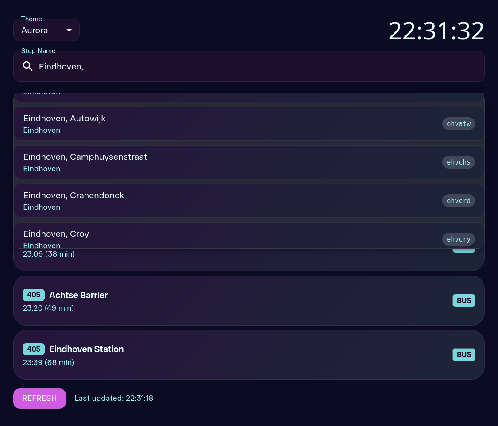
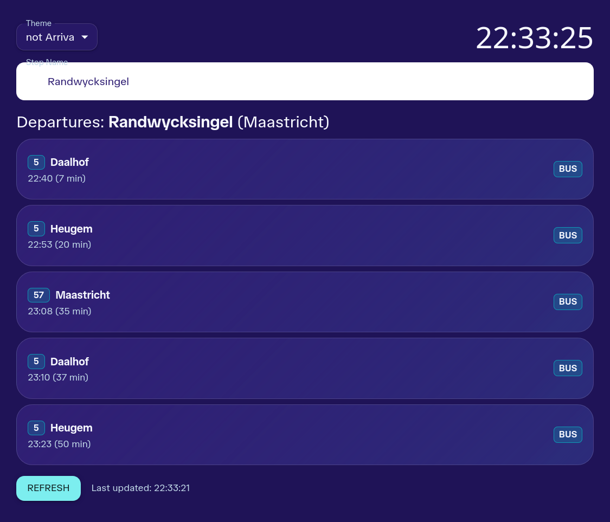
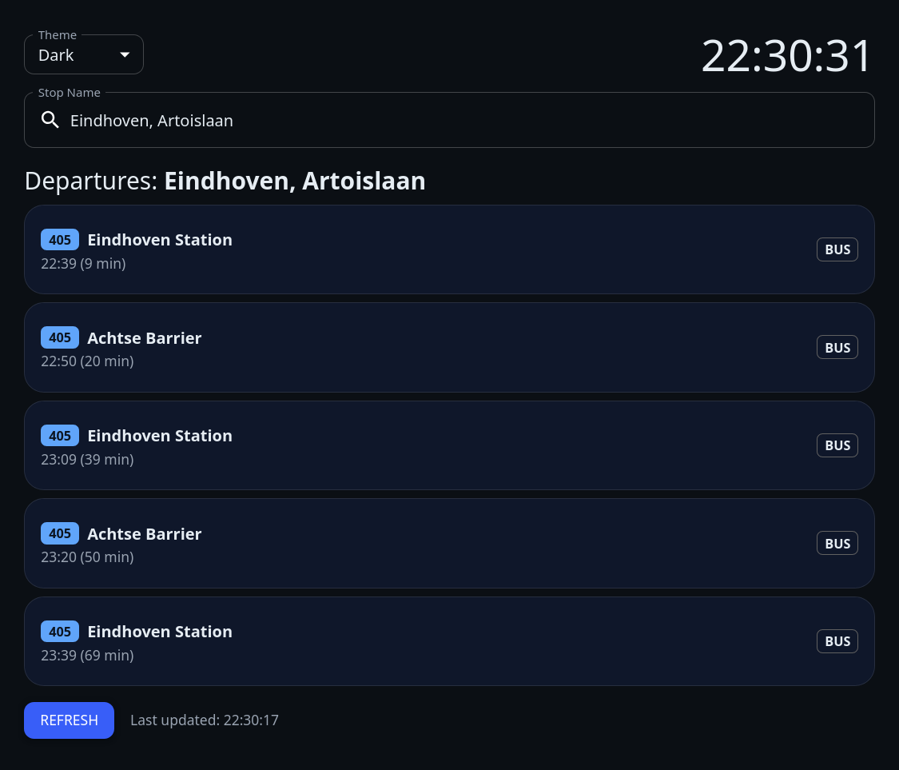

import ImageGrid from "../layouts/ImageGrid.astro"
import Linkbutton from "../components/ButtonLink.astro"
import PhoneImageFrame from "../components/PhoneImageFrame.astro"
import PhoneImg from "../assets/ov-webapp/phone_screen.png"

  
# Departures

<Linkbutton  special={true} project="Departures" label="View Website" href="https://ov-app-ten.vercel.app/" />  
<Linkbutton project="Departures" label="View Code on Github" href="https://github.com/jochempunt/ovApp/" />  

A mobile-first web app that shows real-time departures for Dutch public transport. Users can search stops, see live departure data from the OV-API, 
and switch between multiple custom themes for better visibility and personalization. 
The app focuses on fast updates, clear UI for quick glanceability, and lightweight performance on mobile devices.

## Key features

- Live departure data from the OV-API (metros, buses, trams)
- Searchable stops (fuzzy)
- Mobile-first responsive design with multiple custom themes
- Client-side caching and background refresh using TanStack Query

## Examples (with themes)
<ImageGrid>

</ImageGrid>

## Tech Stack
- React (Vite)
- TanStack Query for data fetching and caching
- OV-API (public transport data)
- MUI component library
- Deployed on Vercel

