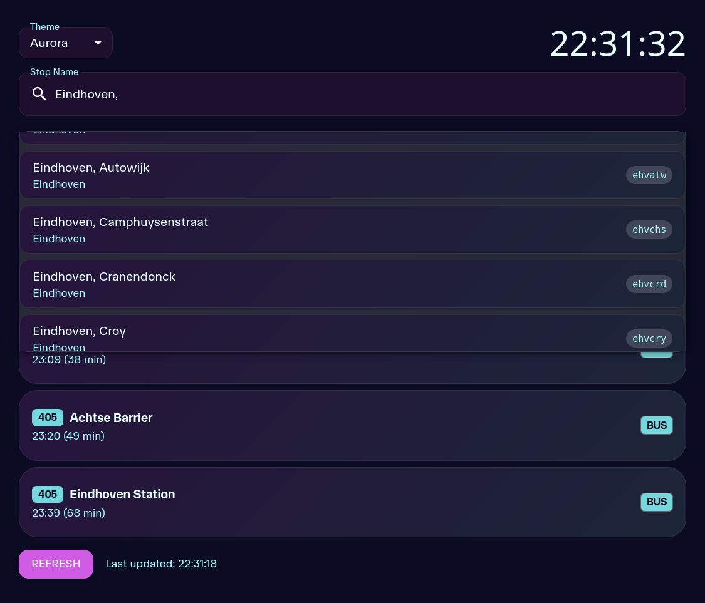
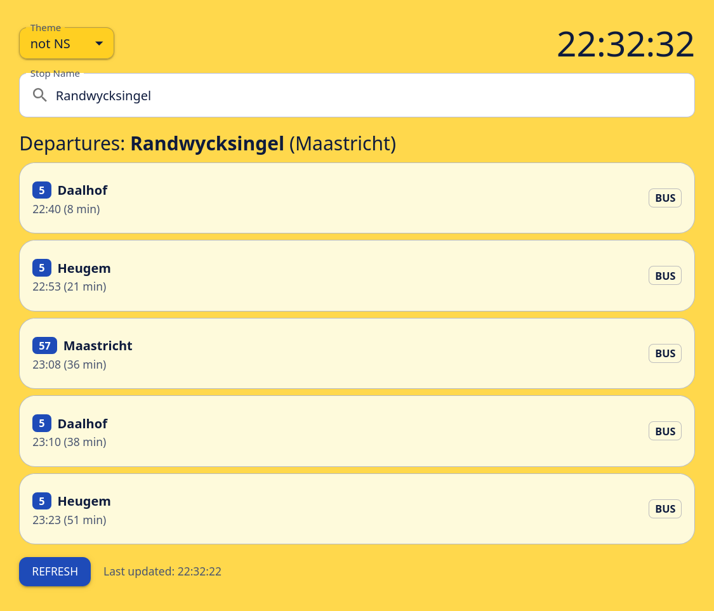
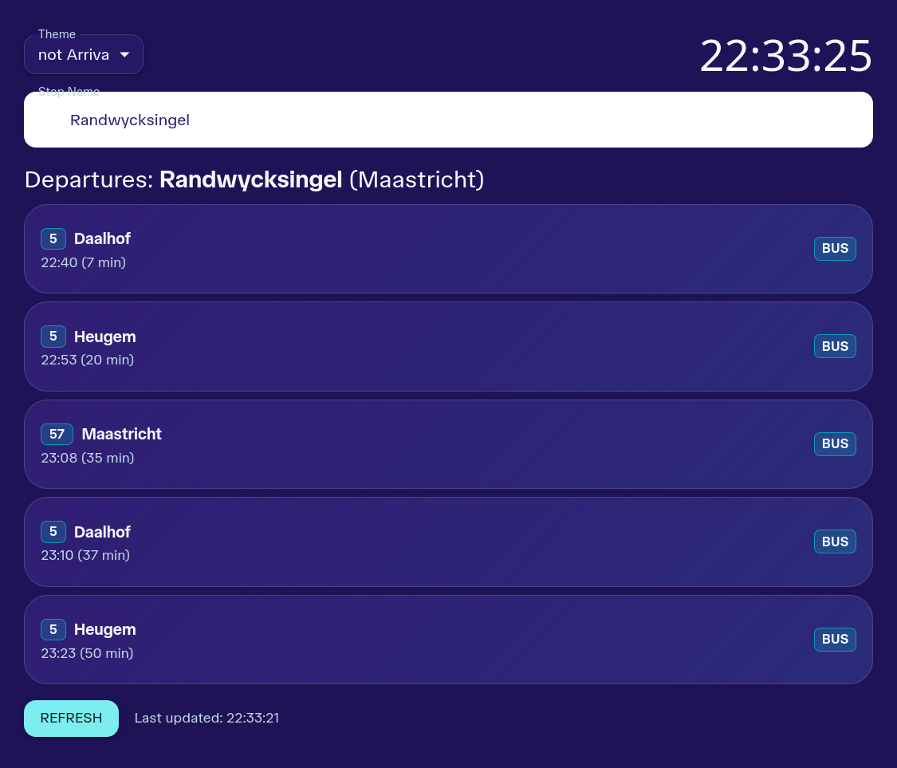
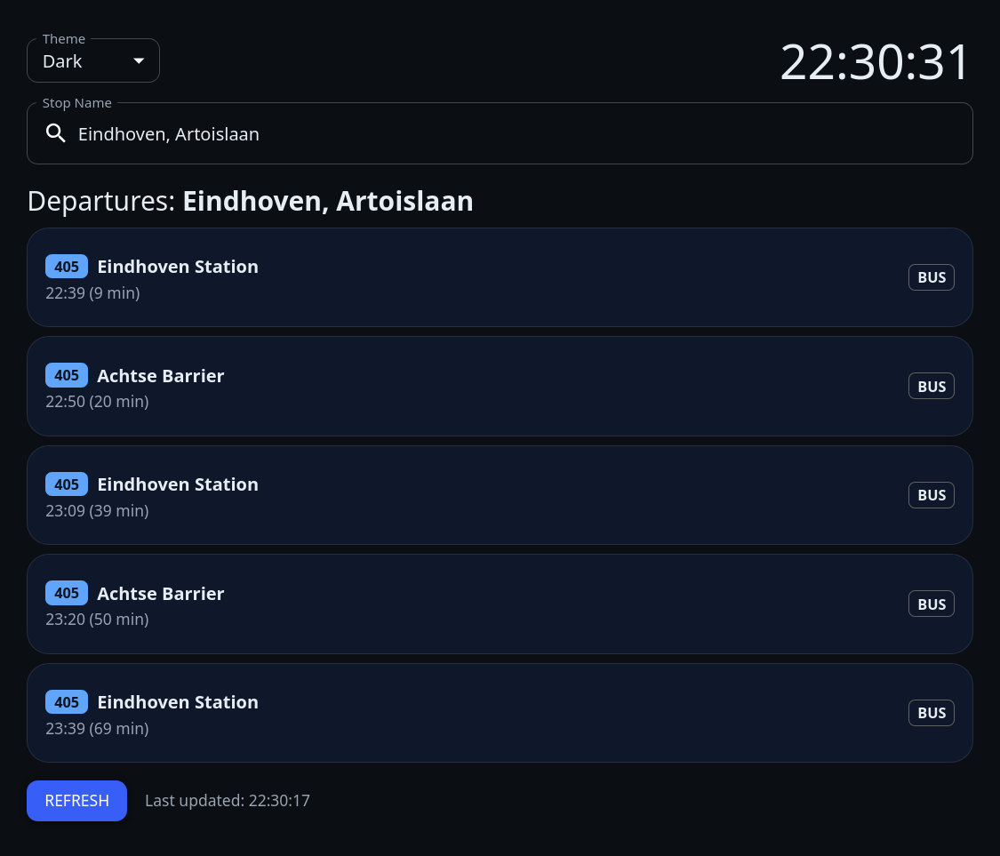

import ImageGrid from "../layouts/ImageGrid.astro"
import Linkbutton from "../components/ButtonLink.astro"
import PhoneImageFrame from "../components/PhoneImageFrame.astro"
import PhoneImg from "../assets/ov-webapp/phone_screen.png"

  
# Departures

<Linkbutton special={"Orange"} label="View Website" href="https://ov-app-ten.vercel.app/" icon="external" />  
<Linkbutton label="View Code on Github" href="https://github.com/jochempunt/ovApp/" icon="github" />  

A mobile-first web app for checking Dutch public transport departures. I made this because I got annoyed losing time with official apps, especially when I'm in a hurry and just need to know if and when my next bus is coming. One tap, easily bookmarkable or installable as a PWA.

## Key features
- Live departure data from the OV-API (metros, buses, trams)
- Searchable stops, sorted by town & stop name 
- Mobile-first responsive design with multiple custom themes
- Client-side caching and background refresh using TanStack Query
- PWA (Progressive Web App) support for offline use and home screen installation
- Shareable links—stops encoded in URL (e.g `?stop=MttAca`) for easy bookmarking and sharing

## Examples (with themes)
<ImageGrid>

</ImageGrid>

## Tech Stack
- React (Vite)
- TanStack Query for data fetching and caching
- OV-API (public transport data)
- MUI component library
- Deployed on Vercel
