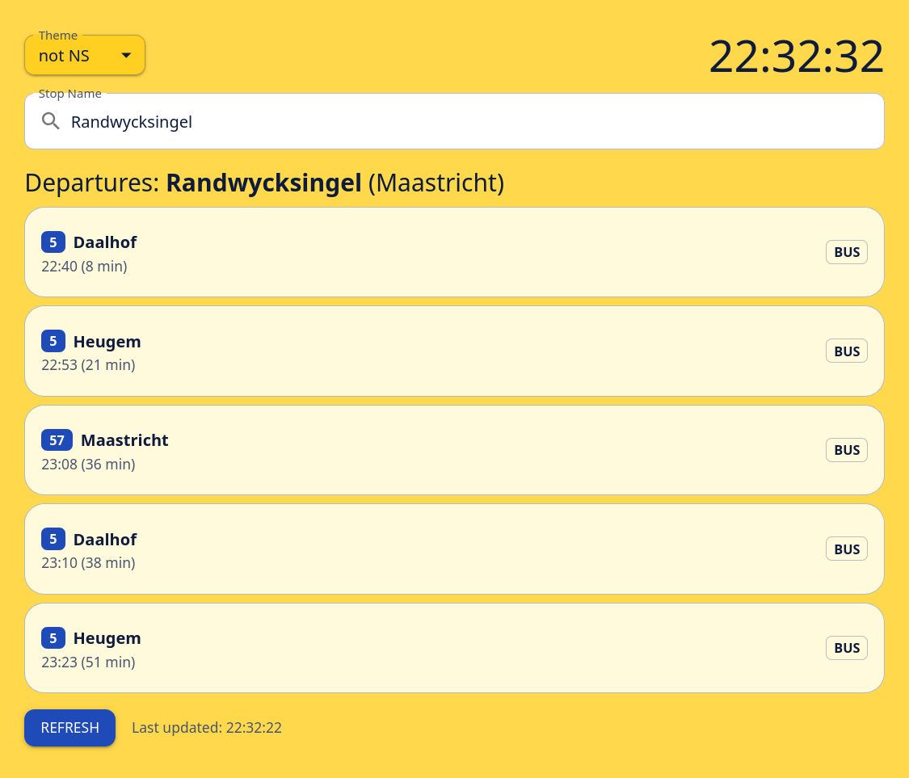

import ImageGrid from "../layouts/ImageGrid.astro"
import GithubLink from "../components/GithubLink.astro"
import PhoneImageFrame from "../components/PhoneImageFrame.astro"
import PhoneImg from "../assets/ov-webapp/phone_screen.png"

  
# Departures
[View live Website](https://ov-app-ten.vercel.app/)

## Examples
<ImageGrid>

</ImageGrid>

## Interactive Mobile demo
<PhoneImageFrame src={PhoneImg} loading="eager" url="https://ov-app-ten.vercel.app/" alt="responsive (mobile) view of 'departures'" width="400px"/>

<GithubLink project="Departures" href="https://github.com/jochempunt/ovApp/" />  
