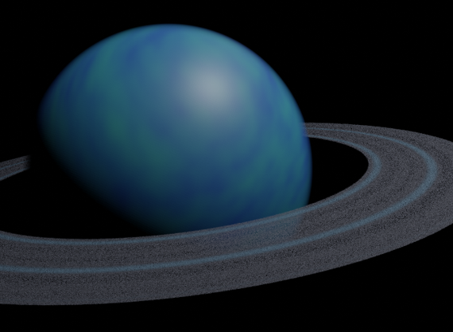
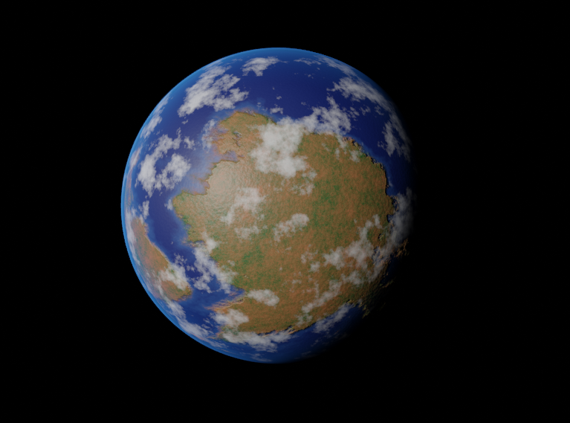
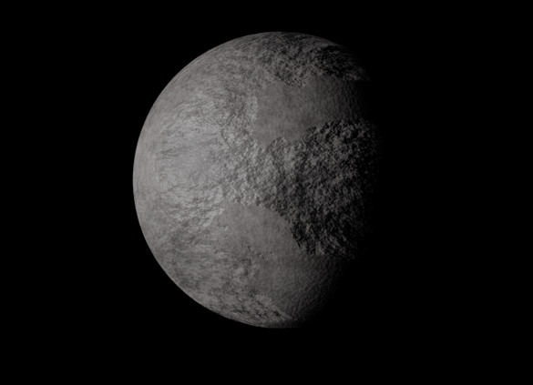

import ImageGrid from "../layouts/ImageGrid.astro"
import GithubLink from "../components/GithubLink.astro"
import CenteredImage from "../components/CenteredImage.astro"
import screenshot_blender from "../assets/planet-generator/screenshot_blender2.png"

# Planet-Generator
This is a Blender plugin written in Python using bpy. It adds an operator that lets you generate customizable planets directly in the 3D Viewport. The tool was created for a university project and supports two main types of planets: Gas Giants and Terrestrial Planets.

## Screenshot of Addon in usee
<CenteredImage src={screenshot_blender} alt={"Screenshot of Gas planet being made with blender addon"} />

## Example planets generated with the addon
<ImageGrid>

</ImageGrid>

<GithubLink href="https://github.com/jochempunt/PlanetenGenerator/" project="Planet Generator" />

